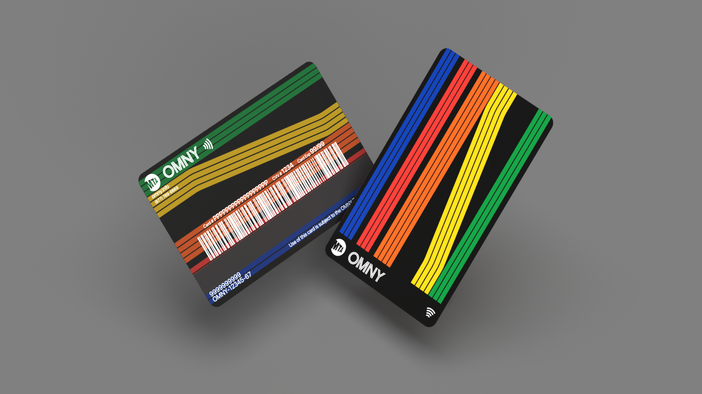
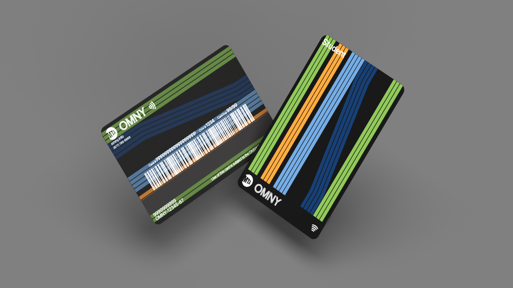
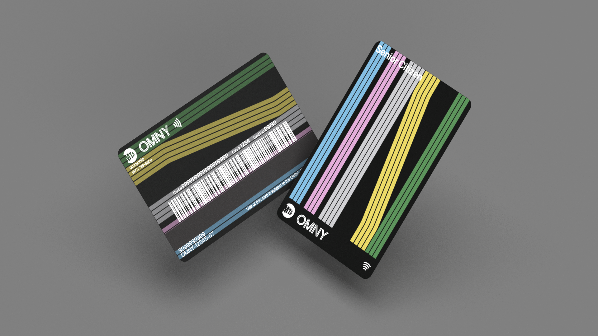
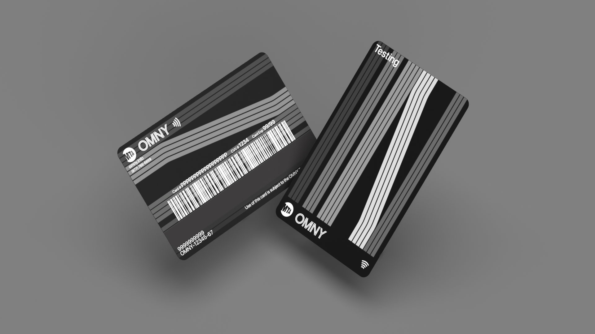
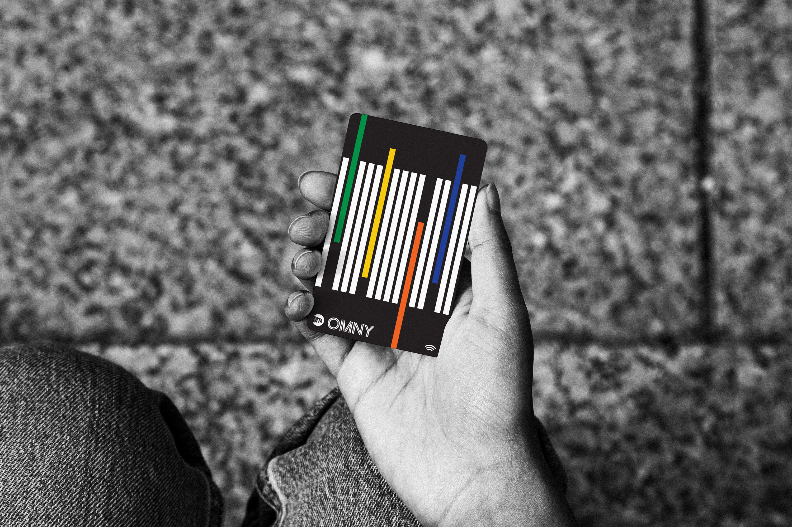
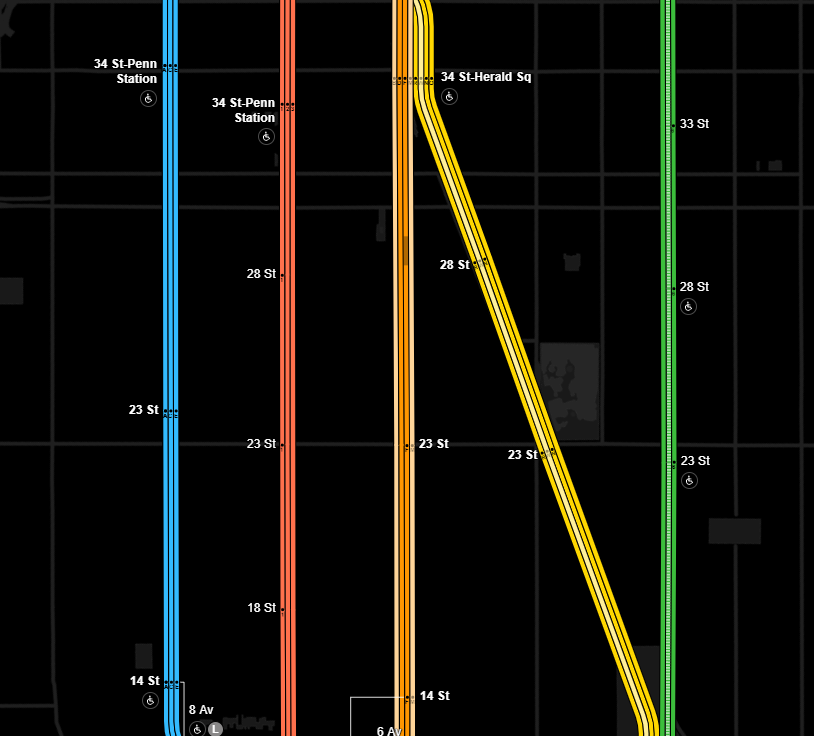

# OMNY Redesigns

The MTA did a (in my opinion) terrible job at designing the OMNY cards so I decided to take a crack at designing them myself.

Designed in Adobe Illustrator and rendered using Adobe Dimension.

---

## Redesign Renders

| | |
|:-------------------------:|:-------------------------:|
|  |  |
|  |  |

## Inspiration

Click on the images to go to their source

